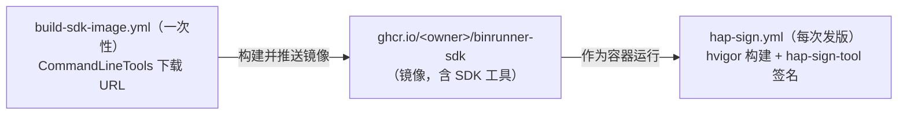

# HAP 构建 & 签名（GitHub Actions）脱敏说明

`Yiklek/BinRunner` 的 HAP 构建 + 签名已封装为
[`.github/workflows/hap-sign.yml`](.github/workflows/hap-sign.yml)。

## 安全模型（脱敏）

- **私钥不落库**：签名私钥（`.p12`）、签名 profile（`.p7b`）、证书（`.cer`）、密码
  全部经 **GitHub Secrets** 注入，仓库里不保存任何可安装的私钥明文。
- **未签名 → 签名两段式**：
  - `hvigorw` 产出**未签名 HAP**（不包含签名块）。
  - `hap-sign-tool sign-app` 用 Secrets 的证书 + profile 签名，产出 `binrunner-signed.hap`。
- CI 运行器是临时的，私钥只在 job 内还原到 `.build/keystore/`，**不会提交回仓库**。

## 需要配置的 Secrets

在仓库 **Settings → Secrets and variables → Actions** 添加：

| Secret | 内容 |
|---|---|
| `BINRUNNER_KEYSTORE_B64` | `debug.p12` 的 base64（签名私钥库） |
| `BINRUNNER_PROFILE_B64` | `debug.p7b` 的 base64（签名 profile，含 device-ids 白名单） |
| `BINRUNNER_CERT_B64` | `debug.cer` 的 base64（app 证书 / 根 CA 链） |
| `BINRUNNER_KEYSTORE_PWD` | keystore 密码 |
| `BINRUNNER_KEY_ALIAS` | keystore 私钥别名（如 `debugKey`） |
| `BINRUNNER_KEY_PWD` | key 密码 |
| `BINRUNNER_SIGN_ALG`（可选） | 签名算法，默认 `SHA256withECDSA` |

### 生成 base64

```bash
base64 -w0 debug.p12   # 输出后粘贴到 BINRUNNER_KEYSTORE_B64
base64 -w0 debug.p7b   # → BINRUNNER_PROFILE_B64
base64 -w0 debug.cer   # → BINRUNNER_CERT_B64
```

## 签名材料从哪来（官方获取流程）

> 背景：鸿蒙安装 HAP 时校验**证书信任链 + Profile 白名单**，与网络 CA 无关；
> 手动在设备上信任自签 CA **无法**绕过（HarmonyOS NEXT 5.0+ 只信任预置根证书）。
> 因此必须走官方签名链：**DevEco Studio 生成密钥/CSR → AGC 申请调试证书与
> Profile（Profile 里勾选测试设备 UDID）→ 用 hap-sign-tool 签名**。

### 第一步：DevEco Studio 生成 Key 和 CSR（本机，一次性）

1. 菜单 `Build > Generate Key and CSR`。
2. **Key Store File（.p12）**：没有则点 `New` 新建——
   - 设**保存路径与文件名**（如 `my_key.p12`）；
   - 设**密码**（≥8 位，含大小写/数字/特殊符号），**牢记**——即 Secrets 的
     `BINRUNNER_KEYSTORE_PWD`；
   - 已有则 `Choose Existing` 复用。
3. **密钥信息**：
   - `Alias`（别名）：自定义，**记下**——即 `BINRUNNER_KEY_ALIAS`；
   - `Validity`：建议 25 年以上；
   - `Certificate`：填组织/城市/国家等。
4. **Generate CSR**：选择保存路径，**文件名必须以 `.csr` 结尾**（如 `my_cert.csr`），
   点 `Finish`。产物：`.p12`（私钥库）+ `.csr`（证书请求）。

> ⚠️ `.p12` 含私钥，**切勿**提交仓库或分享；上 AGC 只上传 `.csr`。

### 第二步：AppGallery Connect 申请调试证书与 Profile

登录 [AppGallery Connect](https://developer.huawei.com/consumer/cn/service/josp/agc/index.html)：

1. **证书**：进入「证书、APP ID 和 Profile」→「证书」→「新增证书」→
   **上传第一步生成的 `.csr`** → 提交后下载得到 **调试证书 `.cer`**
   （即 `BINRUNNER_CERT_B64` 的来源）。
2. **Profile**：同页面「Profile」→ 新增调试 Profile：
   - 选择刚申请的证书；
   - **把测试真机的 UDID 加入设备列表**（缺了会安装失败
     `code:9568323: device unauthorized / UDID not in profile`）；
   - 下载得到 **`.p7b`**（即 `BINRUNNER_PROFILE_B64` 的来源，内含 device-ids 白名单）。

#### 获取设备 UDID（hdc 标准方法）

准备（一次性）：
1. 手机 `设置 > 关于手机`，**连点「软件版本」7 次**进入开发者模式；
2. `设置 > 系统和更新 > 开发人员选项`，打开 **USB 调试**；
3. USB 线连接手机与电脑。

获取命令（`hdc` 位于 DevEco `sdk/default/openharmony/toolchains`，建议加入 PATH）：

```bash
hdc shell bm get --udid     # 或简写：hdc shell bm get -u
```

返回的一长串十六进制字符即设备 UDID。

常见问题：
- `'hdc' 不是内部或外部命令` —— 未进入 `toolchains` 目录或 PATH 未配置；
- `[Fail]ExecuteCommand need connect-key` —— 连了**多台设备**，先
  `hdc list targets` 看设备列表，再用 `-t` 指定目标：

```bash
hdc list targets
hdc -t <设备标识符> shell bm get --udid
```

### 第三步：填入 GitHub Secrets

把三个文件 base64（见上文命令）+ 两个密码/别名填进仓库 Secrets。
key 密码（`BINRUNNER_KEY_PWD`）通常与 keystore 密码相同（生成时只设了一个）。

#### 方式 A：网页手动添加

Settings → Secrets and variables → Actions → New repository secret，逐个粘贴。
base64 内容很长，注意**完整单行**粘贴（断了会报 `不是合法 base64`）。

#### 方式 B：gh CLI 脚本批量设置（推荐）

安装 [gh CLI](https://cli.github.com/)（macOS `brew install gh`；Ubuntu 官方 apt 源
或 [releases](https://github.com/cli/cli/releases) 下载二进制），登录后一键设置：

```bash
gh auth login   # GitHub.com → HTTPS → 浏览器授权或粘贴 PAT（需 repo 权限）

cd /path/to/certs   # debug.p12 / debug.p7b / debug.cer 所在目录
REPO=Yiklek/BinRunner

gh secret set BINRUNNER_KEYSTORE_B64 --body "$(base64 -w0 debug.p12)" -R "$REPO"
gh secret set BINRUNNER_PROFILE_B64  --body "$(base64 -w0 debug.p7b)" -R "$REPO"
gh secret set BINRUNNER_CERT_B64     --body "$(base64 -w0 debug.cer)" -R "$REPO"
gh secret set BINRUNNER_KEYSTORE_PWD --body "<keystore密码>"           -R "$REPO"
gh secret set BINRUNNER_KEY_ALIAS    --body "<alias名>"                -R "$REPO"
gh secret set BINRUNNER_KEY_PWD      --body "<key密码>"                -R "$REPO"

gh secret list -R "$REPO"   # 验证：应列出 6 个
```

> macOS 的 `base64` 无 `-w0`（默认就单行），可直接 `--body "$(base64 < file)"`。

#### 方式 C：纯 Python（无 gh 时）

GitHub Secrets API 只接受 **libsodium sealed box** 密文（因此纯 curl 不行，需要
`pynacl`）。最小脚本：

```python
# pip install pynacl    # GITHUB_TOKEN=ghp_xxx python3 set_secrets.py
import os, json, base64, urllib.request
from nacl import public

REPO = "Yiklek/BinRunner"
API = f"https://api.github.com/repos/{REPO}/actions/secrets"
TOKEN = os.environ["GITHUB_TOKEN"]

def api(method, url, data=None):
    req = urllib.request.Request(url, method=method,
        data=json.dumps(data).encode() if data else None,
        headers={"Authorization": f"Bearer {TOKEN}",
                 "Accept": "application/vnd.github+json"})
    with urllib.request.urlopen(req) as r:
        return r.status, json.loads(r.read() or b"{}")

_, pk = api("GET", f"{API}/public-key")          # ① 仓库公钥
box = public.SealedBox(public.PublicKey(pk["key"].encode()))
b64 = lambda p: base64.b64encode(open(p, "rb").read()).decode()

SECRETS = {                                       # ← 按需修改路径与占位值
    "BINRUNNER_KEYSTORE_B64": b64("debug.p12"),
    "BINRUNNER_PROFILE_B64":  b64("debug.p7b"),
    "BINRUNNER_CERT_B64":     b64("debug.cer"),
    "BINRUNNER_KEYSTORE_PWD": "<keystore密码>",
    "BINRUNNER_KEY_ALIAS":    "<alias名>",
    "BINRUNNER_KEY_PWD":      "<key密码>",
}
for name, value in SECRETS.items():               # ② 加密 ③ 提交
    enc = base64.b64encode(box.encrypt(value.encode())).decode()
    status, _ = api("PUT", f"{API}/{name}",
                    {"encrypted_value": enc, "key_id": pk["key_id"]})
    print(f"{name}: HTTP {status}", "OK" if status in (201, 204) else "FAIL")
```

HTTP `201`（新建）/ `204`（覆盖）均成功。PAT 需要 classic `repo` 权限，
或 fine-grained 的 *Secrets: Read and write*。

### 换新测试设备怎么办

Profile 的设备白名单在 AGC 签发时固定。新设备装不上（`UDID not in profile`）时：
1. AGC → Profile → 编辑该调试 Profile → **加入新设备 UDID** → 重新下载 `.p7b`；
2. 更新 Secret `BINRUNNER_PROFILE_B64`（其余不变）；
3. 重跑 HAP Build & Sign，用新产出的 HAP 安装。

> 区分**调试/发布证书**：发布证书签的包不能装真机调试；CI 里应全程使用
> **调试证书 + 调试 Profile**。

## 前置：构建 SDK 镜像（一次性）

`hap-sign.yml` 在 GitHub Actions 的 `ubuntu-22.04` 干净环境里构建 HAP，但该环境
**没有** HarmonyOS 的构建工具（hvigor、ohpm、clang++ 等）。所以先构建一个
**预装好 Command Line Tools + SDK 的容器镜像**，`hap-sign.yml` 用这个镜像作为容器跑。

这个镜像由 [`build-sdk-image.yml`](build-sdk-image.yml) 构建并推送到
`ghcr.io/<owner>/binrunner-sdk:latest`（GitHub 容器仓库）。



**何时需要跑**：
- 首次配置 CI 时跑一次；
- 或 HarmonyOS Command Line Tools / SDK 升级时重跑。

**如何跑**（Actions 页 → **Build SDK Image** → Run workflow）：
- 用默认的 Command Line Tools 下载 URL（华为官方压缩包，含 command-line-tools + sdk）；
- 或者填入你自己的下载 URL（覆盖 `cmd_tools_url` 输入）。

**执行条件与需要设置什么**：

| 项目 | 说明 |
|---|---|
| 触发方式 | 仅手动（`workflow_dispatch`），无 tag/commit 自动触发 |
| 权限 | workflow 已声明 `contents: read` + `packages: write`，**无需手动设置** |
| 登录 ghcr.io | 用 `secrets.GITHUB_TOKEN`（GitHub 自动提供，**无需配置**） |
| 输入参数 | `cmd_tools_url`（必填，已预填默认 URL，直接 Run 即可） |
| 镜像推送目标 | `ghcr.io/<fork owner>/binrunner-sdk:latest`（fork 自己的 ghcr 命名空间） |

**常见坑**：
- **下载 URL 过期**：默认 URL 带华为签名参数（`HW-CC-Sign`/`HW-CC-Expire`），有时效。
  下载失败（403/404）时去
  [华为开发者下载页](https://developer.huawei.com/consumer/cn/download/) 重新获取
  `commandline-tools-linux-x64-*.zip` 的新 URL 填入。
- **zip 布局识别**：Dockerfile 自适应 zip 内部结构；若 `sdk` 目录没找到会有 WARNING，
  构建末尾会验证 `ohpm`/`hvigorw`/`clang` 是否可用，失败即中止。

**安全性**：该镜像只含**公开的 SDK 工具**（无签名私钥），构建镜像本身不涉及脱敏；
签名私钥只在 `hap-sign.yml` 的 job 里从 Secrets 临时还原。

> 若你本机已装好 Command Line Tools / SDK（如本地开发环境），那是**本机路径**，
> CI 用不到；CI 必须用这个 `binrunner-sdk` 镜像。

## 触发方式

- 手动：Actions 页 → **HAP Build & Sign** → Run workflow
- 推 tag：`git push origin v1.2.0`

## 产物

- `binrunner-signed.hap` —— 已签名，用 `bm install` 装到 profile 白名单设备。
- `binrunner-unsigned.hap` —— 未签名，可用**自己的证书/Profile** 自行签名（见下）。

## 自助签名（用本地证书给 unsigned HAP 签名）

[`scripts/sign-hap.sh`](../../scripts/sign-hap.sh) 封装了 hap-sign-tool 的签名命令，
配合自己的证书目录即可给 `binrunner-unsigned.hap` 签名：

```bash
# 证书目录含 debug.cer / debug.p7b / debug.p12（你自己的签名材料）
KEYSTORE_PWD='<你的keystore密码>' KEY_ALIAS='<你的alias>' \
  scripts/sign-hap.sh binrunner-unsigned.hap my-signed.hap ./certs
```

说明：
- 密码**只走环境变量**（不进命令行历史/CI 日志）；`KEY_PWD` 缺省同 `KEYSTORE_PWD`。
- 自动定位 `hap-sign-tool.jar`（DevEco SDK / CI 镜像常见路径）；找不到时设
  `HAP_SIGN_TOOL=<jar路径>` 或 `DEVECO_SDK_HOME=<sdk根>`。
- `SIGN_ALG` 可选，默认 `SHA256withECDSA`。
- 你的 profile 白名单里须包含目标设备 UDID，否则签名成功也装不上。

## 本地回退（无 Secrets）

`build.sh` 证书来源优先级：
1. `BINRUNNER_KEYSTORE_B64` / `BINRUNNER_PROFILE_B64` / `BINRUNNER_CERT_B64`（CI/发布）
2. `.github/docker/certs/`（本地开发回退）
3. openssl 自签（仅本地调试，p7b 为空，**不可安装**）
